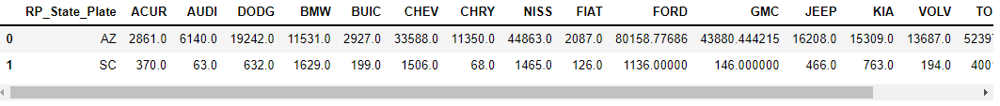

# pyspark-project-cgi

Pyspark mini-project CGI Data Engineer Academy

[Project Trello Board](https://trello.com/b/OBYp7AMJ/pyspark-project-2)

## About the Project

The Parking Citation Dataset is a public dataset collecting millions of records information about parking tickets for a county in California.

We only selected a million of this data for us to work with in this assignment. You can see the [whole dataset here](https://data.lacity.org/Transportation/Parking-Citations/wjz9-h9np/data).

In this assignment we want you to Extract data, Clean data, Create a report, and then the report as a new file.

## Steps

1. Read the `csv` file from the url as a "Pyspark" DataFrame.
2. Count number distinct values for each column
3. Count nulls in every column
4. Write a function to drop columns with more than 1% missing values
5. Impute missing values for `Fine_amount` column with "median" using `Imputer` package from Pyspark
6. Drop rows with at least two null values
7. Extract values of a string column and create new columns based on those values
8. Create a broadcast variable stores the full names of states. Show a dataframe output showing the states full names. Read the questions carefully and Export three reports based on them:
9. Create First report, then Export it as "Report_Make_State_Fine"
10. Create Second Report, then Export it as "Report_HOND_2016"
11. Create Third Report, then Export it as "Report_Parking_Fines_2016"

### Resources

- [Pyspark](https://sparkbyexamples.com/)

---

## Deliverables

- [ ] Databricks Community Notebook
- [ ] `Report_Make_State_Fine.csv` With header and "|" deliminer. Report  table to get the Sum of `Fine_Amounts` for each State Plates (`RP_State_Plate` column) for each selected vehicle make company (`Make` column).  The selected brands are: `Make_Cars = ["ACUR", "AUDI", "DODG", "BMW", "BUIC", "CHEV", "CHRY", "NISS","FIAT", "FORD", "GMC", "JEEP", "KIA", "VOLV", "TOYT", "SUBA", "MAZD"]`

Final report should look like:

